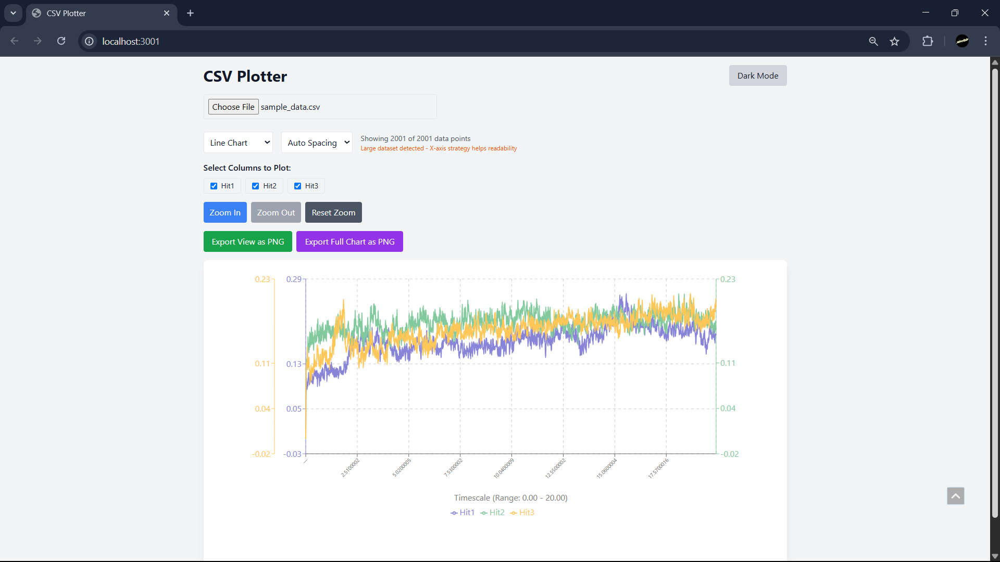

# ScientiFlow-Frontend

A React project styled with Tailwind CSS.

## Getting Started

Follow these steps to clone and run the project locally.

### Clone the repository

```
git clone https://github.com/SoumyadipCodes19/ScientiFlow-Frontend.git
cd ScientiFlow-Frontend
````

### Install dependencies

```
npm install
```

### Run the development server

```
npm start
```

The app will be available at `http://localhost:3000` in your browser.


## Build for production

To create an optimized build:

```
npm run build
```

The production-ready files will be in the `build` folder.


## Screenshots

Below are screenshots of the final application:

### Homepage


### Dashboard



---

## License

MIT License